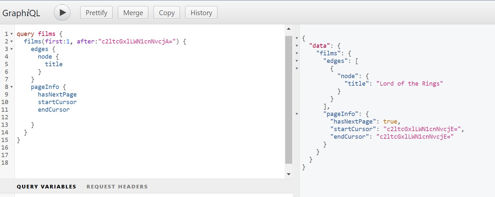

# Films - GraphQL
A playground for exploring GraphQL using the DGS Framework provided by Netflix.

## Notes on Pagination
The `first` parameter is the first x number of items after the cursor: 
The `after` parameter is the cursor.

- The `first` and `after` parameters still need to be specified in the schema; however, the implementations
  are provided out of the box
- DGS specifically looks for these keywords, e.g., I found that swapping out `first` to be
  called `size` instead did not work
- The cursor is defined by the framework, as seen in the `pageInfo` section

## Useful Links
official documentation: https://netflix.github.io/dgs/advanced/relay-pagination/
example: https://medium.com/@umesh382.kushwaha/pagination-with-netflix-dgs-dcdc59feaf11